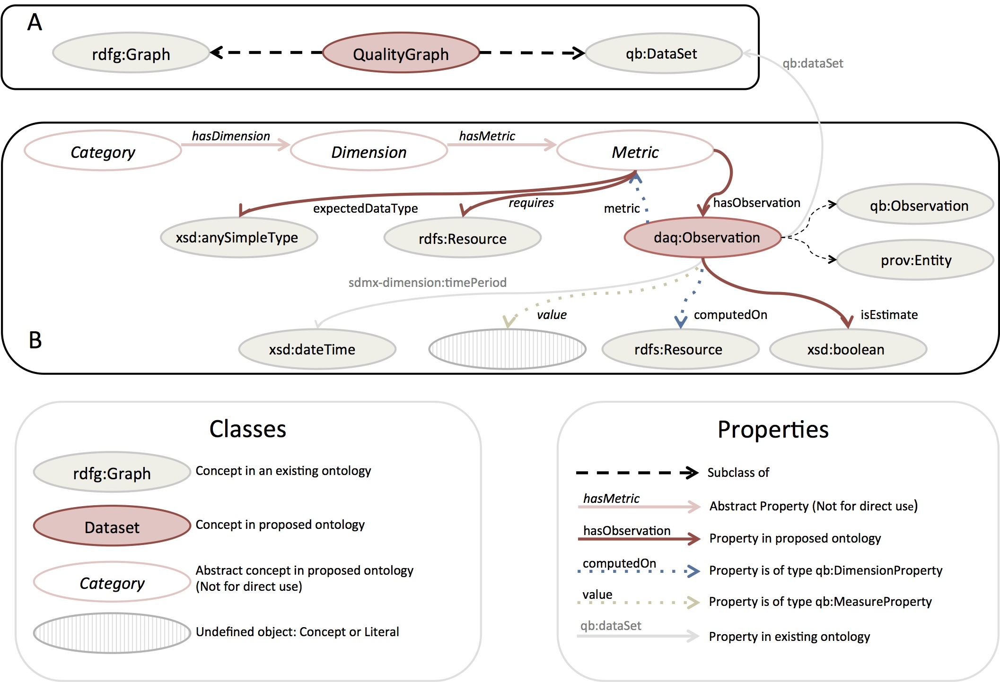
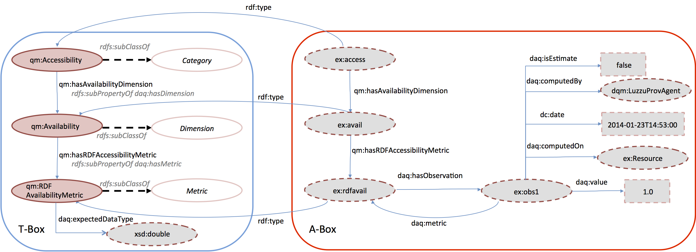

=== Introduction
The idea behind the Dataset Quality Ontology (daQ) is to provide a generic core vocabulary, allowing a uniform definition of specific data quality metrics. This metric definition would then allow publishers to represent the metadata resulting from benchmarking the quality of their datasets, or even to attach (recommended) this metadata to their linked datasets.

[[img-ontology]]

=== Basic Concepts
Quality metadata is intended to be represented as a http://purl.org/eis/vocab/daq#QualityGraph[Quality Graph]. The latter concept is a subclass of http://www.w3.org/2004/03/trix/rdfg-1/Graph[rdfg:Graph]. This means that the quality metadata is stored and managed in a named graph that is separate from the dataset but can be embedded into the dataset if desired. A quality graph comprises a number of different http://purl.org/eis/vocab/daq#Category[Categories], which in turn possess a number of quality http://purl.org/eis/vocab/daq#Dimension[Dimensions]. A quality dimension groups one or more quality http://purl.org/eis/vocab/daq#Metric[Metrics]. The latter three concepts are abstract, thus these are not intended to be used directly to initialise new resources.

A Metric can have one or more observations. The http://purl.org/linked-data/cube#[Data Cube Vocabulary] allows the representation of statistical observations in multidimensional spaces. Reusing the standardised Data Cube Vocabulary in daQ allows us to represent quality metadata of a dataset as a collection of http://purl.org/linked-data/cube#Observation[Observation]. These observations allow us to analyse the quality of a dataset over multiple observations, for example across the revision history of a dataset.

=== Metric Concepts
A metric instance should have *One* or more observations, linked by the http://purl.org/eis/vocab/daq#hasObservation[has observation] property.
Each observation also has a http://purl.org/dc/elements/1.1/date[date] property, which holds the timestamp of when it was computed.
The provenance of an observation is also required, where an http://www.w3.org/ns/prov#Agent[Agent] is to be defined using the http://purl.org/eis/vocab/daq#computedBy[computed by] property.
The property http://purl.org/eis/vocab/daq#isEstimate[isEstimate] indicates if the observation value was estimated by the metric.
The http://purl.org/eis/vocab/daq#value[value] of a metric has an open range and this is defined by the specific metric implementation.
The latter datatype should be explicitly defined by the http://purl.org/eis/vocab/daq#expectedDataType[expected datatype] property.

=== Extending the daQ

The classes of the core daQ ontology are intended to be extended by specific and custom quality metrics that characterise a dataset in a particular domain. *Extending* the daQ ontology means adding new quality protocols that inherit the abstract concepts (Category - Dimension - Metric). Custom quality metrics do not need to be included in the daQ namespace itself; in fact, in accordance with LOD best practices, we recommend extenders to make them in their own namespaces.
Figure 2 shows an illustrative example of extending the daQ ontology (TBox) with a more specific quality attribute (the RDF Availability Metric) and an illustrative instance (ABox) of how it would be represented in a dataset.

[[img-example]]

=== Publishing daQ Metadata Records
We encourage publishers of linked _open_ data to offer daQ metadata as an RDF named graph in their published dataset. Since such a daQ metadata record requires a lot of metrics to be computed, it is not normally intended to be authored manually. Publishing platforms such as http://www.datahub.io[datahub.io] should offer such an on-demand computation to dataset publishers. For more information about applications that compute quality metrics and return daQ metadata, please go to *Applications using daQ*.

The turtle listing below shows a typical daQ metadata instance.
[source]
ex:qualityGraph1 a daq:QualityGraph ;
	qb:structure daq:dsd . 
ex:qualityGraph1 {
	ex:accessibilityCategory a dqm:Accessibility ;
		dqm:hasAvailabilityDimension ex:availabilityDimension .		
	ex:availabilityDimension a dqm:Availability ;
		dqm:hasEndPointAvailabilityMetric ex:endPointMetric ;
		dqm:hasRDFAvailabilityMetric ex:rdfAvailMetric .
	ex:endPointMetric a dqm:EndPointAvailabilityMetric ;
		daq:hasObservation ex:obs1, ex:obs2 .
	ex:obs1 a qb:Observation ;
		daq:computedOn <http://example.org/dataset/v1> ;
		dc:date "2014-01-23T14:53:00"^^xsd:dateTime ;
		daq:value "1.0"^^xsd:double ;
		daq:metric ex:endPointMetric ;
		qb:dataSet ex:qualityGraph1 ;
		daq:computedBy dqm:LuzzuProvenanceAgent ;
		daq:isEstimated false .
	ex:obs2 a qb:Observation ;
		daq:computedOn <http://example.org/dataset/v2> ;
		dc:date "2014-01-25T14:53:00"^^xsd:dateTime ;
		daq:value "1.0"^^xsd:double ;
		daq:metric ex:endPointMetric ;
		qb:dataSet ex:qualityGraph1  ;
		daq:computedBy dqm:LuzzuProvenanceAgent ;
		daq:isEstimated false .
	ex:rdfAvailMetric
		a dqm:RDFAvailabilityMetric ;
		daq:hasObservation ex:obs3, ex:obs4 .		
	ex:obs3 a qb:Observation ;
		daq:computedOn <http://example.org/dataset/v1> ;
		dc:date "2014-01-23T14:53:01"^^xsd:dateTime ;
		daq:value "1.0"^^xsd:double ;
		daq:metric ex:rdfAvailMetric ;
		qb:dataSet ex:qualityGraph1  ;
		daq:computedBy dqm:LuzzuProvenanceAgent ;
		daq:isEstimated false .	
	ex:obs4 a qb:Observation ;
		daq:computedOn <http://example.org/dataset/v2> ;
		dc:date "2014-01-25T14:53:01"^^xsd:dateTime ;
		daq:value "0.0"^^xsd:double ;
		daq:metric ex:rdfAvailMetric ;
		qb:dataSet ex:qualityGraph1  ;
		daq:computedBy dqm:LuzzuProvenanceAgent ;
		daq:isEstimated false .
	# ... more quality triples
}

_ex:qualityGraph1_ is a named http://purl.org/eis/vocab/daq#QualityGraph[Quality Graph]. The defined graph is automatically a http://purl.org/linked-data/cube#DataSet[cube DataSet], and due to the restriction placed on the http://purl.org/eis/vocab/daq#QualityGraph[Quality Graph] with a defined http://purl.org/eis/vocab/daq#dsd[cube structure]. The named graph _ex:qualityGraph1_ defines a number of metrics and observations based on the daQ structure (Figure 1 Box B).

=== Why Use daQ
In this section we discuss possible use case scenarios for the Dataset Quality Vocabulary. **TODO**

=== Applications using daQ
**TODO**

=== More Information
* Debattista, J., Lange, C., & Auer, S. (2014). daQ, an Ontology for Dataset Quality Information. Linked Data on the Web (LDOW). -  http://eis-bonn.github.io/Luzzu/papers/ldow2014.pdf[Download]
* Debattista, J., Lange, C., & Auer, S. (2014). Representing dataset quality metadata using multi-dimensional views. In Proceedings of the 10th International Conference on Semantic Systems - SEM ’14 (pp. 92–99). New York, New York, USA: ACM Press. doi:10.1145/2660517.2660525 - http://eis-bonn.github.io/Luzzu/papers/semantics2014.pdf[Download]